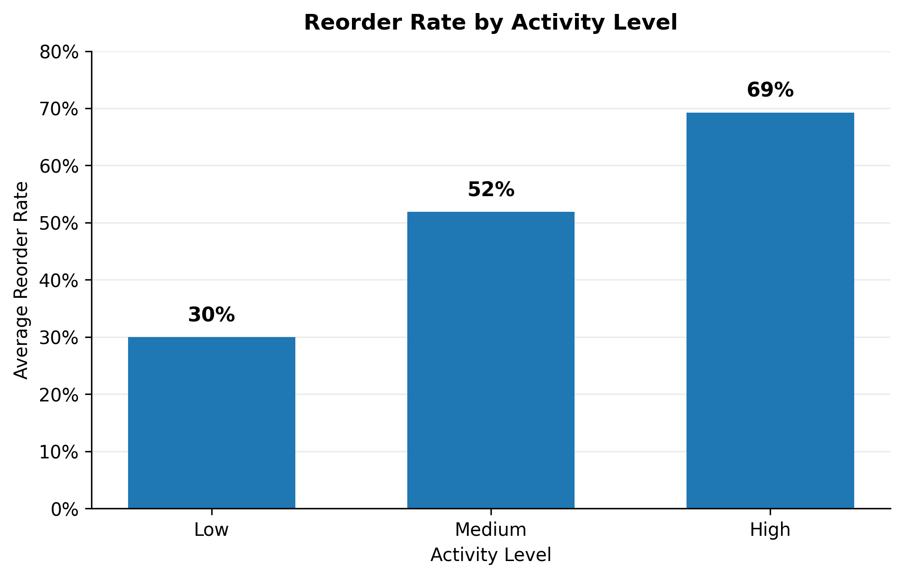
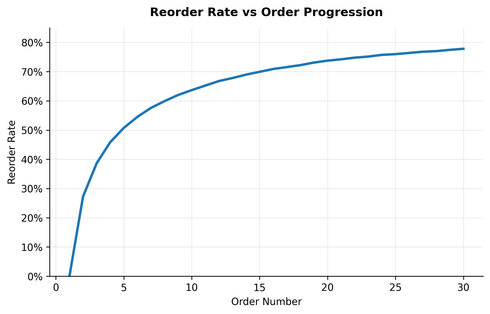
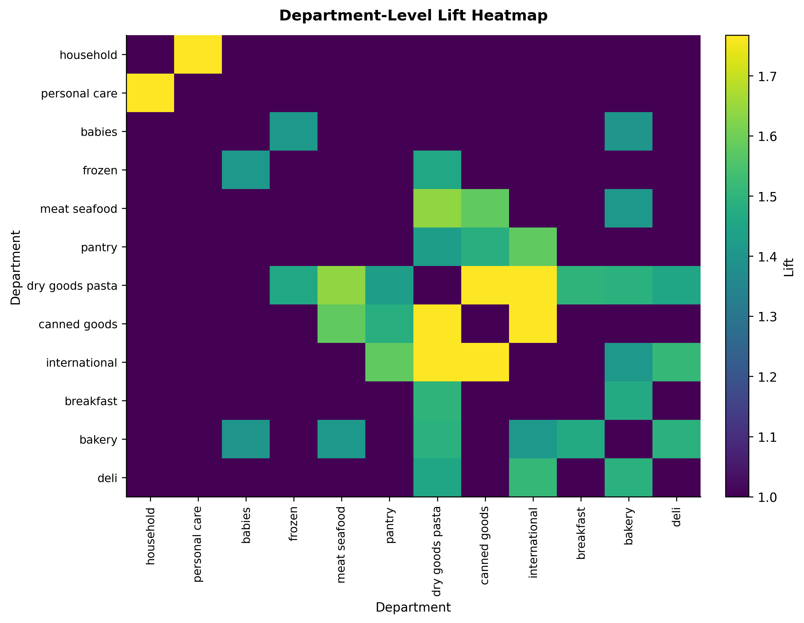
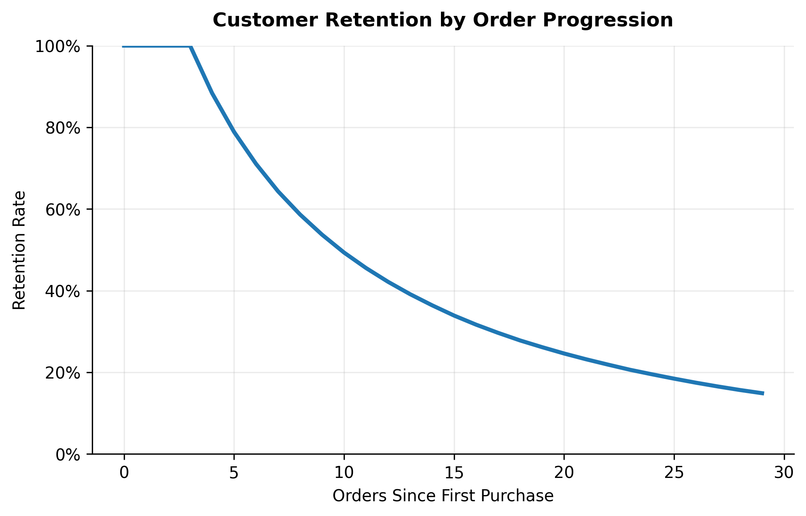

# Habit Formation in Online Grocery (Instacart)

**Type:** Retail Behavioral Analysis  
**Tools:** PostgreSQL, Python (pandas, matplotlib)  
**Dataset:** Instacart Online Grocery Basket Dataset (Kaggle)

## Overview
This project analyzes 30M+ grocery transactions to understand how customer purchasing behavior changes with continued usage. I focus on (1) habit formation via reorder rates, (2) cross-category purchasing structure using lift, and (3) order continuation patterns among repeat customers.

## Key Findings
- **Reorder rates rise with engagement:** low-activity users reorder ~30% of items, while high-activity users reorder nearly ~70%.
- **Reorder growth follows a log-like curve:** most of the increase happens early, then stabilizes as baskets become routine.
- **Categories are bought in predictable combinations:** department-level lift reveals common pairings (e.g., pasta + canned goods; household + personal care).
- **Continuation among repeat customers:** engagement narrows over time, but remaining customers exhibit more stable, habitual purchase patterns.

## Figures
| Metric | Plot |
|---|---|
| Reorder rate by activity |  |
| Reorder vs order progression |  |
| Department lift heatmap |  |
| Order continuation curve |  |

## How to Reproduce (high level)
1. Load the Instacart CSVs into PostgreSQL (see `sql/01_load_data.md`).
2. Create feature tables and views (see `sql/02_feature_tables.sql`).
3. Run analysis queries + generate plots

## Notes / Limitations
- The Kaggle Instacart dataset is structured for reorder prediction and consists of repeat customers; it is not a full acquisition/churn dataset.

## Credits
- Dataset: Instacart via Kaggle.
- Project implementation and analysis: [SangHyun Kim].
